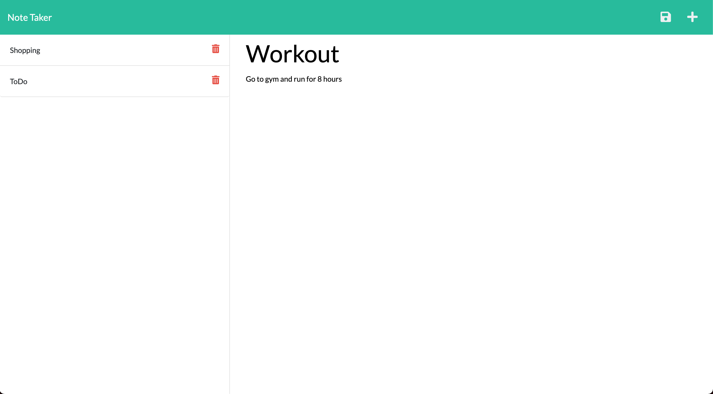
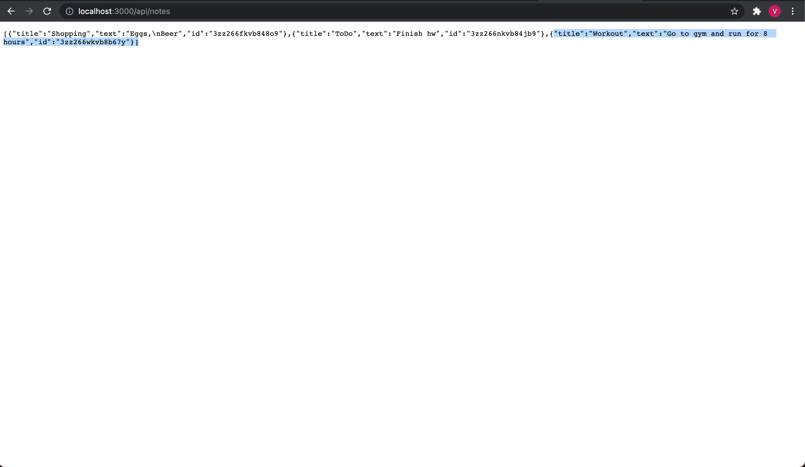

# Team Profile Generator

## Description
This is web application that allows a user to create and delete notes to better help manage the things they need to do.
## Table of Contents
- [Installation](#installation)
- [Instructions](#instructions)
- [Credits](#credits)
- [License](#license)
## Installation
Nodejs
## Instructions
First, install all node dependencies, and then use 'nodemon server.js' in the terminal to run the application.
Second, open your web browser (preferable chrome), and go to 'http://localhost:3000/'

Example of adding a note\

\
Example of the api route

## Credits
Vitaliy Trach - [GitHub Profile](https://github.com/vitaliytrach)
## License
This product is licensed under the MIT license.
## How to Contribute
N/A
## Tests
N/A
## Questions
Email: vitaliytrach@gmail.com
GitHub: [vitaliytrach](https://github.com/vitaliytrach)